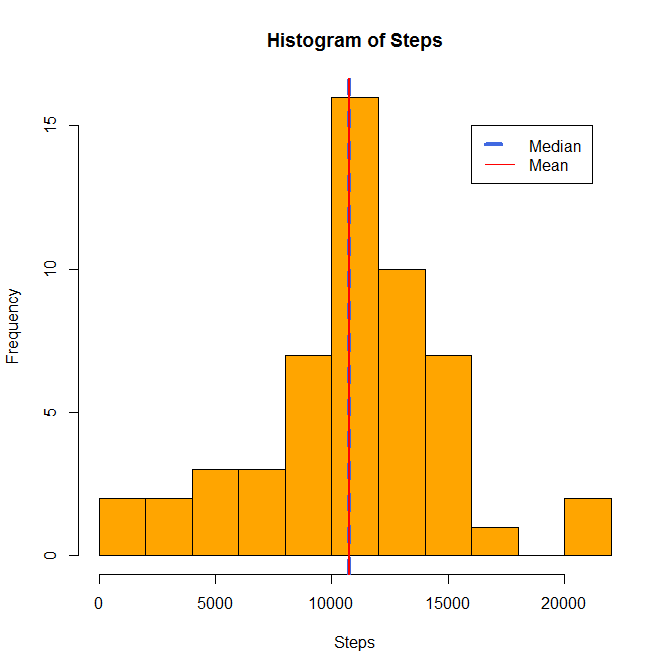
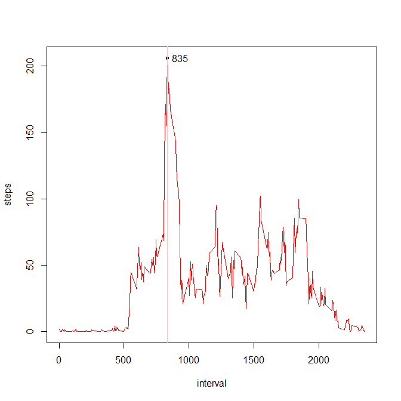
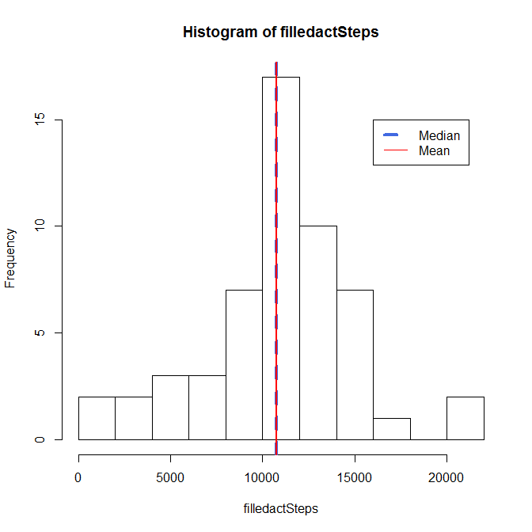

# Reproducible Research: Peer Assessment 1


## Loading and preprocessing the data


```r
unzip("activity.zip")
act <- read.csv("activity.csv")
library(dplyr)
act_day <- act %>% select ( steps, date) %>% filter(!is.na(steps)) %>% group_by(date) %>% summarize(steps = sum(steps) )
Steps <- act_day$steps
med <- median(Steps)
mea <- mean(Steps)
```


## What is mean total number of steps taken per day?


```r
hist(Steps , breaks = 10, col="orange" )
legend (16000,15,c("Median ","Mean "),lwd = c(4,1),lty=c(2,1),col=c("royalblue","red"))
abline(v = med,col = "royalblue",lwd = 4, lty = 2)
abline(v = mea,col = "red",lwd = 2)
par(xpd=TRUE)
legend (0,-10,c(paste("Median ",med),paste("Mean ",mea)))
```



```r
print (paste("Median = ",med))
```

```
## [1] "Median =  10765"
```

```r
print (paste("Mean = ",mea))
```

```
## [1] "Mean =  10766.1886792453"
```


## What is the average daily activity pattern?


```r
act_min <- act %>% select ( steps, interval) %>% filter(!is.na(steps)) %>% group_by(interval) %>% summarize(steps = mean(steps) )
plot(act_min,type="l", col="red")
xymax <- act_min[act_min$steps == max(act_min$steps,na.rm = TRUE),]
text(xymax$interval + 100,xymax$steps,xymax$interval)
points(xymax$interval,xymax$steps, pch=20)
abline(v=xymax$interval, col="pink")
```



```r
print (paste("Interval with maximum number of steps = ",xymax$interval))
```

```
## [1] "Interval with maximum number of steps =  835"
```


## Imputing missing values

```r
# Create a copy of the activity data frame
filledact <- act

# Create a function to retrieve the rounded interval average
natoave <- function (interval){
  round(act_min[act_min$interval == interval,]$steps)
}

# Replace all NA's in step with it's interval average 
filledact$steps  <-  ifelse (is.na(filledact$steps),natoave(filledact$interval),filledact$steps)
```


```r
filledact_day <- filledact %>% select ( steps, date) %>% filter(!is.na(steps)) %>% group_by(date) %>% summarize(steps = sum(steps) )
filledactSteps <- filledact_day$steps
med <- median(filledactSteps)
mea <- mean(filledactSteps)
print (paste("Median = ",med))
```

```
## [1] "Median =  10763.5"
```

```r
print (paste("Mean = ",mea))
```

```
## [1] "Mean =  10766.1111111111"
```

```r
hist(filledactSteps , breaks = 10 )
legend (16000,15,c("Median ","Mean "),lwd = c(4,1),lty=c(2,1),col=c("royalblue","red"))
abline(v = med,col = "royalblue",lwd = 4, lty = 2)
abline(v = mea,col = "red",lwd = 2)
```



####Using the interval average to fill the missing Step values, did not greatly impact the study figures, slightly changing the median and the mean. 

## Are there differences in activity patterns between weekdays and weekends?

